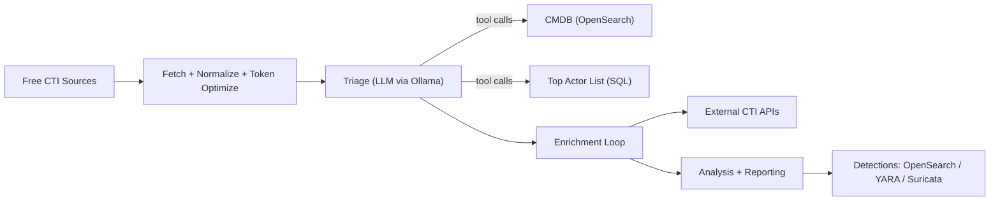

## cti-agent-sample

Template for a **cyber threat intelligence (CTI) agent** that fetches public threat intel, triages it using a local LLM (via Ollama), enriches key entities/IOCs with external sources, and produces actionable reporting plus starter detection content.

This repo is intentionally **generic** (not tied to a specific enterprise ecosystem). Integrations are provided as interfaces + examples you can adapt.

## What it does (end-to-end)

### Part 1: Fetch data
- **Fetch threat intel from free sources** (advisories / bulletins / feeds).
- **Normalize & compress** content to optimize token usage (HTML → text, boilerplate removal, dedupe, “toon”/summary conversion, chunking).

### Part 2: Triage (LLM + internal context)
- Use a local model (template assumes **Mistral 7B** via **Ollama**).
- The model can call tools to:
  - Query a **CMDB** (example: OpenSearch index) to understand exposed/high-value assets.
  - Query a **Top-20 threat actor list** (example: SQL table) to prioritize relevant actors.
- Output: a **ranked list** of “concerning” items with rationale and what to do next.

### Part 3: Agent-loop enrichment
- Extract from bulletins:
  - **Threat actors, campaigns, malware**
  - **IOCs** (hashes, IPs, domains, emails, URLs, etc.)
- Use tools to enrich entities/IOCs via APIs.
  - **Free API sources (examples to wire in)**:
    - AlienVault **OTX** (pulses/indicators)
    - `abuse.ch` **ThreatFox** (IOC context)
    - `abuse.ch` **MalwareBazaar** (hash intelligence)
    - `abuse.ch` **URLhaus** (malicious URL intelligence)
    - **urlscan.io** (URL / domain scan context)
  - **Paid sources (placeholders)**:
    - Recorded Future
    - DomainTools
    - VirusTotal
    - GreyNoise
    - (Add others as needed)

### Part 4: Analysis and reporting
- Produce:
  - **Executive summary** (daily “news bulletin” for leadership)
  - **Operational actions & defensive recommendations** that are specific (environment-aware) and avoid generic advice like “enable MFA”.

### Part 5: Hunting & detections
- Generate starter detection content:
  - **OpenSearch detections**
  - **YARA rules**
  - **Suricata rules**

## Local dev quickstart (template)

### Prereqs
- Python 3.11+
- Ollama installed and running

### Pull a model in Ollama
```bash
ollama pull mistral:7b
```

### Configure
Create a local `.env` from `.env.example` and set API keys you have (free and/or paid). Keys are optional; the template will run with enrichment disabled.

### Run (once scaffolded)
```bash
python -m cti_agent run --input examples/sample_bulletin.txt --out out/
```

## Architecture (high level)


## Repo layout (scaffold)
- `cti_agent/`: Python package (pipeline + tool interfaces)
- `connectors/`: Example connector implementations (OpenSearch, SQL, CTI APIs)
- `examples/`: Sample bulletins and config
- `out/`: Generated reports/detections (gitignored)

## Sample outputs (for review)
- `examples/sample_outputs/cti_report.md`
- `examples/sample_outputs/run_metadata.json`

## Notes
- This is a **template**: you’ll plug in your org’s data sources, auth, and schemas.
- Do **not** commit secrets. Use `.env` locally and keep `.env.example` sanitized.

