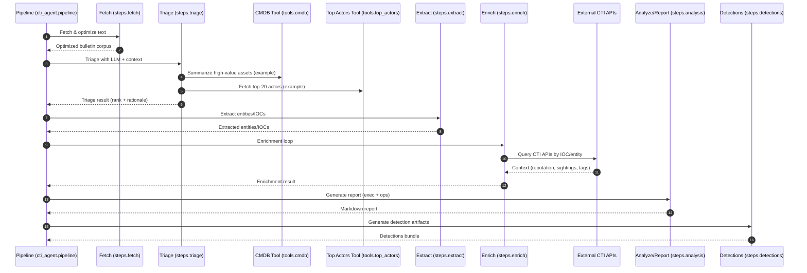

## Architecture (CTI Agent Template)

This document is a technical overview of how the **CTI agent pipeline** is intended to work as a template.
It explains the component boundaries, data flow, scoring, and extension points.

> Repo note: the current code is a scaffold. Some connectors are placeholders by design.

## Goals
- **Token-efficient ingestion** of public CTI bulletins/feeds
- **Environment-aware triage** using a local LLM + internal context (CMDB + top actor list)
- **Agent-loop enrichment** of extracted entities/IOCs using CTI APIs (free and paid)
- **Actionable reporting** (exec + operational) with specific defensive recommendations
- **Detection artifacts** generation (OpenSearch detections, YARA, Suricata)

## Non-goals (for this template)
- A fully productionized scheduler / distributed worker system
- A complete SIEM/SOAR integration layer
- Opinionated enterprise-specific schemas or controls

## High-level data flow

```mermaid
flowchart TD
  subgraph Ingest["Part 1: Fetch + Normalize + Token Optimize"]
    F1[Free CTI feeds\n(CISA KEV, abuse.ch, OTX, urlscan, ...)]
    F2[Fetchers\nHTTP/RSS/JSON]
    F3[Normalizer\nstrip boilerplate, dedupe,\nchunk, compress/toon]
    F1 --> F2 --> F3
  end

  subgraph Triage["Part 2: Triage (LLM + Internal Context)"]
    L1[Ollama LLM\n(Mistral 7B template)]
    C1[CMDB tool\n(OpenSearch index)]
    C2[Top actor tool\n(SQL query)]
    F3 --> L1
    L1 -->|tool call| C1
    L1 -->|tool call| C2
  end

  subgraph Enrich["Part 3: Agent-loop enrichment"]
    X1[Entity/IOC extraction]
    E1[Enrichment tools\n(free + paid APIs)]
    E2[IOC context cache\n(optional)]
    L1 --> X1 --> E1 --> E2
  end

  subgraph Report["Part 4: Analysis + Reporting"]
    R1[Executive bulletin]
    R2[Operational actions\n& recommendations]
    E2 --> R1
    E2 --> R2
  end

  subgraph Detect["Part 5: Detections"]
    D1[OpenSearch detections]
    D2[YARA rules]
    D3[Suricata rules]
    E2 --> D1
    E2 --> D2
    E2 --> D3
  end
```

## Pipeline sequence (runtime)



## Data model (conceptual)

### Bulletin
- **source**: where it came from (feed name / URL)
- **timestamp**: ingest time (and bulletin publish time when available)
- **raw_body**: original content
- **normalized_text**: cleaned content (token optimized)
- **metadata**: tags, vendor, CVEs, etc. (optional)

### Extraction result
- **entities**: threat actors, malware, campaigns (as strings initially)
- **iocs**: typed list(s): ip / domain / url / hash / email / etc.
- **confidence**: extraction confidence (optional; often improves with LLM+validation)

### Enrichment result
- Per-IOC **observations**: reputation, sightings, ASN, WHOIS age, sandbox hits, tags
- Per-source **provenance**: which source said what, and when

## SCC (Source, Credibility, Confidence) scoring

To keep this template generic and explainable, a simple SCC model is recommended for every “finding”:

- **Source (S)**: where the intel came from
  - examples: CISA, vendor advisory, abuse.ch, OTX pulse author, etc.
- **Credibility (C)**: trustworthiness of the source (stable publisher vs unknown)
  - encode as a tier or a numeric score (e.g., 1–5)
- **Confidence (C)**: confidence in the specific claim/IOC in your environment
  - driven by: corroboration across sources, freshness, enrichment results, and internal telemetry

### Example SCC aggregation (template logic)
- Start with source credibility baseline (publisher tier)
- Increase confidence when:
  - multiple independent sources corroborate an IOC/entity
  - enrichment shows recent sightings / high prevalence
  - internal context indicates exposure (CMDB + internet-facing + criticality)
- Decrease confidence when:
  - indicator is stale
  - enrichment shows “benign/legit” classification
  - indicator is too generic (common CDN IPs, broad domains)

> SCC can be used to guide triage ranking, enrichment depth, and how aggressive detection rules should be.

## Tool surfaces (LLM ↔ tools)

The template is designed so the model can request *context* rather than ingesting large raw datasets.

- **CMDB tool** (`cti_agent.tools.cmdb`):
  - goal: produce compact summaries (crown jewels, exposures, critical apps, owners)
  - avoid dumping full CMDB documents into the prompt
- **Top actor tool** (`cti_agent.tools.top_actors`):
  - goal: a small ranked list with tags/priority
- **Enrichment tools** (`cti_agent.tools.enrichment_*`):
  - goal: per-indicator context with provenance and “why it matters”

## Token optimization strategy (Part 1)

Recommended layers (progressively more aggressive):
- **HTML → text** and boilerplate removal
- **Deduplicate** repeated boilerplate across advisories
- **Chunk & summarize** long bulletins (toon conversion / structured summary)
- **Preserve facts**: CVEs, versions, IOCs, TTPs, detection notes
- **Compress metadata**: avoid verbose paragraphs where a table/list works

## Where to extend the template

### Add / modify feeds
- `cti_agent.tools.feeds.get_default_free_feeds()`
- Add a per-feed connector if special handling is needed (pagination, auth, schema)

### Add internal context integrations
- Implement real OpenSearch queries in `cti_agent.tools.cmdb.OpenSearchCmdbClient`
- Implement real SQL execution in `cti_agent.tools.top_actors.SqlTopActorsClient`

### Improve extraction
- Add validators/normalizers (IOC canonicalization)
- Add LLM extraction with JSON schema + deterministic validation
- Add campaign/actor/malware entity resolution

### Improve enrichment loop
- Add caching (by IOC + TTL)
- Add rate limiting / retry policy
- Add merging rules (conflict resolution) and provenance tracking

### Improve detections
- Convert “ideas” to actual:
  - OpenSearch detection rule JSON
  - YARA module structure + test harness
  - Suricata rule format + PCAP testing guidance

## Operational considerations
- **Rate limits**: external CTI APIs will throttle; use caching and backoff
- **Safety**: never auto-execute “active” actions (scans, detonations) without explicit enablement
- **Secret management**: keep keys in `.env` or a secret store; do not commit them
- **Observability**: log which sources contributed to each conclusion (provenance)
- **Reproducibility**: store normalized bulletins + enrichment snapshots with timestamps

