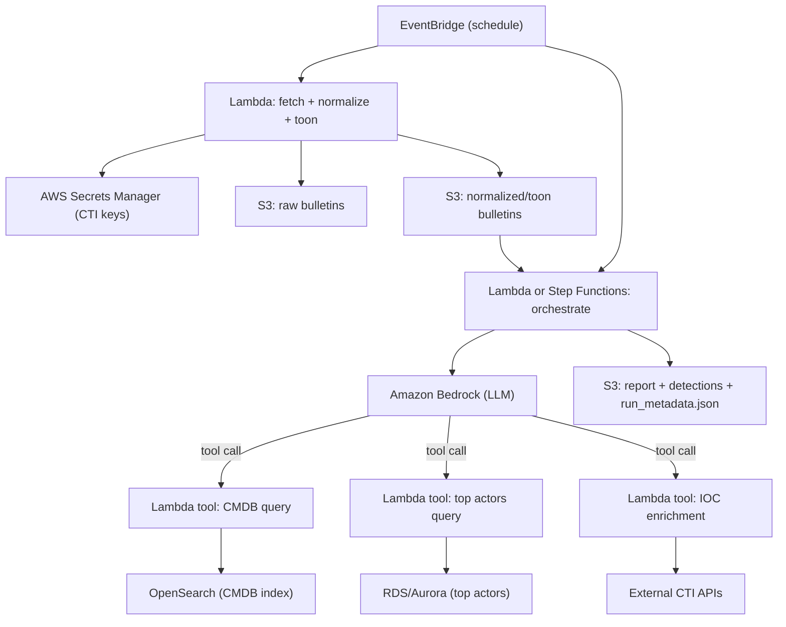

## Cloud-native reference architecture (AWS)

This document describes a **cloud-native** option for running the CTI agent pipeline on AWS.
It is intended as a **template**: adapt naming, IAM boundaries, and data stores to your environment.

## Overview

### Goals
- Run ingestion + analysis on a schedule (or event-driven)
- Keep secrets in **AWS Secrets Manager (ASM)**
- Run model reasoning through **Amazon Bedrock**
- Persist artifacts to **S3** (reports, detections, run metadata, and optionally normalized bulletins)

### Primary components
- **EventBridge**: schedule / trigger orchestration
- **Lambda**: ingestion (fetch) + orchestration + tool handlers
- **Secrets Manager (ASM)**: store CTI API keys and internal service credentials
- **Amazon Bedrock**: model inference (and optionally Agents)
- **S3**: durable output storage (and optionally input staging)

Optional additions (recommended for scale):
- **SQS**: decouple ingestion from processing; control concurrency
- **Step Functions**: explicit orchestration, retries, and observability
- **DynamoDB**: state, run tracking, dedupe keys, cursors, TTL caches
- **OpenSearch (managed/serverless)**: CMDB-like index and/or searchable CTI corpus
- **RDS/Aurora**: top-actor list and other reference data

## High-level data flow

## Pipeline mapping (AWS ↔ repo concepts)

### Part 1: Fetch + toon optimization
- **Lambda: `fetch`**
  - Pull from free feeds/APIs
  - Normalize and “toon” compress (token optimization)
  - Write:
    - `s3://<bucket>/runs/<run_id>/bulletins/raw/...`
    - `s3://<bucket>/runs/<run_id>/bulletins/toon/...`

### Part 2: Triage (Bedrock + internal context)
Two common approaches:

- **Option A (simpler): Orchestrator-managed tool loop**
  - Orchestrator Lambda prompts Bedrock
  - Based on structured output, orchestrator calls tools (CMDB, top actors)
  - Feeds tool results back into Bedrock

- **Option B (Bedrock Agents): model-driven tool calling**
  - Bedrock Agent invokes tool Lambdas directly
  - Tool Lambdas retrieve secrets from ASM as needed
  - Orchestrator persists final outputs to S3

> Secret handling note: whether the model “sees” secrets is a policy decision. Best practice is:
> - **Model never receives secrets**. Tools fetch secrets from ASM and only return non-sensitive results.

### Part 3: Enrichment loop
- **Lambda tools** encapsulate each enrichment source:
  - Free sources (e.g., abuse.ch, OTX, urlscan)
  - Paid sources (e.g., Recorded Future, DomainTools, VirusTotal)
- The orchestrator/agent:
  - Extracts IOCs/entities from toon text
  - Calls enrichment tools per IOC/entity (with caching and rate limiting)

### Part 4: Reporting
- Bedrock generates:
  - executive summary
  - operational actions and environment-aware recommendations
- Stored to:
  - `s3://<bucket>/runs/<run_id>/report/cti_report.md`

### Part 5: Detections
- Bedrock generates detection artifacts (starter templates)
- Stored to:
  - `s3://<bucket>/runs/<run_id>/detections/...`

## Outputs in S3

Recommended layout:
- `runs/<run_id>/run_metadata.json`
- `runs/<run_id>/bulletins/raw/<source>/<id>.txt`
- `runs/<run_id>/bulletins/toon/<source>/<id>.txt`
- `runs/<run_id>/enrichment/<ioc_type>/<value>.json`
- `runs/<run_id>/report/cti_report.md`
- `runs/<run_id>/detections/generated_detections.md`

## Security and IAM (template guidance)

### IAM boundaries
- **Fetcher Lambda role**
  - read: ASM secrets for CTI API keys
  - write: S3 `runs/*/bulletins/*`
  - network egress allowed (NAT if in VPC)

- **Orchestrator Lambda / Step Functions role**
  - read: S3 toon bulletins
  - invoke: Bedrock
  - invoke: tool Lambdas
  - write: S3 `runs/*/(report|detections|run_metadata.json)`

- **Tool Lambda roles (CMDB / top actors / enrichers)**
  - least-privilege access to their backing stores
  - read ASM secrets they specifically require

### Encryption
- S3 buckets encrypted with **SSE-KMS**
- Secrets Manager uses **KMS**
- Consider customer-managed keys and key policies for least privilege

## Operational considerations
- **Dedupe/cursors**: store last-seen IDs per feed in DynamoDB
- **Caching**: cache enrichment results by IOC+TTL in DynamoDB or S3
- **Rate limiting**: per-source concurrency controls via SQS and reserved concurrency
- **Observability**:
  - CloudWatch logs + metrics
  - structured run metadata in S3 for review and audit

## Open questions / decision points
- **Bedrock Agents vs orchestrator-managed tool loop**
  - Agents reduce orchestration code but may complicate strict control over tool inputs/outputs.
- **Secrets exposure model**
  - Strong recommendation: keep secrets in tools only; return redacted summaries to the model.

